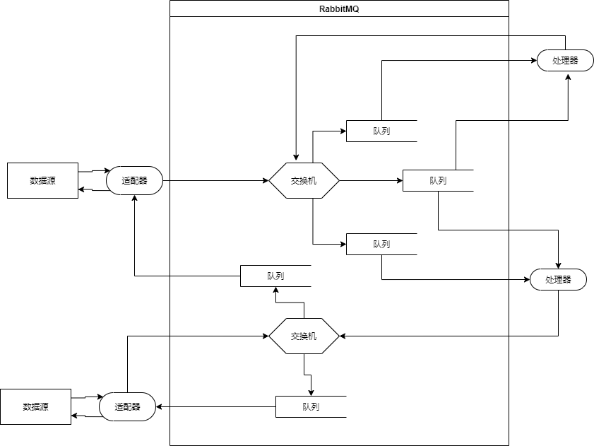

# NyaaBot

## 简介

这是一个聊天机器人框架，它使用AMQP协议来传递不同来源的消息并加以处理后发送到指定的目标。

## 架构

本项目的子项目除了`common`和`docs`以外，分为两类，`adapter`和`processor`。

`adapter`是适配器，它提供对于某个外部消息源和目标的接入，它应当监听并维护至少一个`Queue`，它从消息源捕获消息并发送到`Exchange`，然后从监听的`Queue`消费消息并发送到特定的目标。

`processor`是处理器，它监听多个`Queue`，按一定的规则从某些`Queue`中获取消息，然后将处理后的消息重新发送给特定的`Exchange`。

每一个`adapter`和`processor`都应当在自己的`README.md`中说明如何在配置文件中配置监听队列和交换机。

